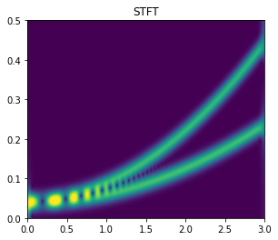
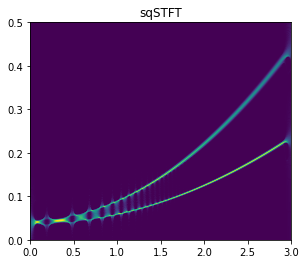
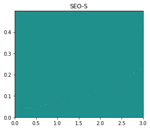

# python-of-time-and-frequency-analysis
---

> **This is a toolbox of time-frequency analysis based on Python.**  

---
## Introduction

It includes Short Time Fourier Transform (STFT), S-transform (ST), Wigner-Ville 
distribution(WVD), and Continuous Wavelet Transform (CWT).

 

In response to the increasing demand for time-frequency aggregation, synchronous squeezing(Sq) and synchronous extraction(SET) have been added to the toolbox for SqSFTF and SEO-S.

 
 

---

## Contribution

[1] Python-based time-frequency analysis method (excluding CWT).

[2] Synchronous squeezing(Sq) and synchronous extraction(SET) based on Python.

---
## Warning

This program does not use English as code comments!
